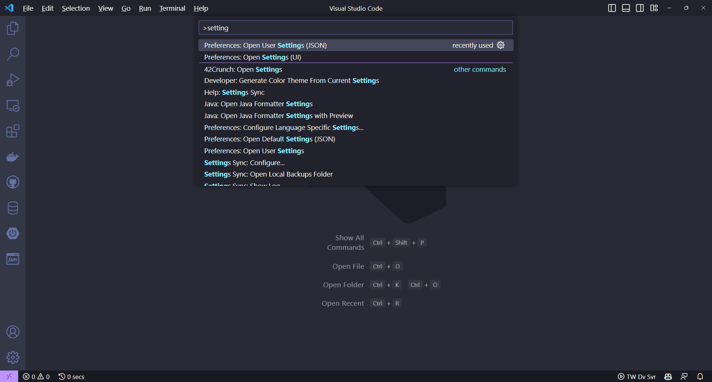

# Configuração do Ambiente

Nesse documento, você encontrará as instruções necessárias para configurar o ambiente .NET necessário para o desenvolvimento do projeto.

## Instalação do .NET SDK

### Windows

Vamos ver como é o processo de instalação do .NET no Windows.

1. Acesse o [site do .NET](https://dotnet.microsoft.com/en-us/)
2. Clique no botão “Download” para ser redirecionado para a página de download
3. Clique no botão de “Download .NET SDK” para então realizar o download do instalador do .NET

Após realizar o download do assistente de instalação basta executá-lo e seguir o processo padrão de instalação de softwares no Windows (next, next, next, finish).

Após finalizar o processo de instalação precisamos verificar se a instalação foi realizada com sucesso, para isso abra um terminal (PowerShell ou Prompt) e execute o comando abaixo:

```bash
dotnet --version
```

Caso não ocorra nenhum erro após a execução do comando acima significa que o processo de instalação do .NET foi realizado com sucesso.

### Linux

O processo de instalação do .NET no Linux pode variar dependendo da distribuição que você esteja utilizando, neste artigo eu irei demonstrar o processo de instalação em uma distribuição Ubuntu pois é a distribuição Linux mais comum de se utilizar, caso você esteja utilizando outra distribuição então recomendo que leia as instruções de instalação específicas para a sua distribuição diretamente na [documentação do .NET](https://docs.microsoft.com/en-us/dotnet/core/install/linux).

Para realizar a instalação no Linux Ubuntu podemos utilizar o próprio gerenciador de pacotes APT, para isso execute os comandos abaixo:

```bash
sudo apt update
sudo apt install -y apt-transport-https
sudo apt update
sudo apt install -y dotnet-sdk-6.0
```

Após a execução dos comandos acima o .NET já estará instalado em sua máquina e agora só é necessário verificar se a instalação foi realizada com sucesso, para isso execute o comando abaixo:

```bash
dotnet --version
```

Se nenhum erro ocorrer após a execução do comando significa dizer que a instalação foi realizada com sucesso.

### MacOS

A instalação do .NET no MacOS é bem semelhante ao processo de instalação no Windows, basta [baixar o assistente de instalação](https://dotnet.microsoft.com/en-us/download), logo em seguida executar o mesmo e seguir com o processo padrão (next, next, finish).

Após finalizar o processo de instalação abra o terminal e execute o comando abaixo para verificar se a instalação foi realizada com sucesso:

```bash
dotnet --version
```

Caso não seja exibido nenhum erro significa dizer que a instalação foi realizada com sucesso.

## Instalação do VSCode

### Windows

Primeiramente realize o download do [assistente de instalação](https://code.visualstudio.com/Download "assistente de instalação"), o processo de instalação é bem simples, basta seguir o modo padrão de instalação de programas no Windows (next, next, next, install).

Porém tenha certeza que na segunda tela do assistente a opção "Adicione em PATH (disponível após reiniciar)" esteja marcada, dessa maneira será possível abrir o editor pelo terminal com o comando `code`.


### Linux

Existem diversas maneiras de realizar a instalação do VS Code no Linux, você pode usar o comando `dpkg` através de um arquivo .deb e também do comando `apt`, porém a maneira mais recomendada atualmente é utilizando os pacotes `snap`.

Para realizar a instalação usando pacotes `snap` basta executar o seguinte comando:

```bash
sudo snap install code --classic
```

Com o comando acima o VS Code vai ser instalado e já estará disponível para uso.

### MacOS

Realize o download do [instalador do VS Code](https://code.visualstudio.com/Download "instalador do VS Code"), uma vez feito o download basta abrir o instalador e copiar o VS Code para a pasta applications do seu MacOS.

## Configuração do VSCode

É recomendado que você instale a seguinte extensão no VSCode:

- [C#](https://marketplace.visualstudio.com/items?itemName=ms-dotnettools.csharp)

Além de realizar a instalação da extensão do C#, também é recomendado realizar algumas configurações para habilitar a funcionalidade de autocomplete e auto using.

Para isso use o atalho CTRL + SHIFT + P, para abrir a paleta de comandos, no campo de busca procure por "settings" e selecione a opção "Preferences: Open User Settings (JSON)".



No arquivo que for aberto coloque o seguinte código:

```json
{
  "dotnet.completion.showCompletionItemsFromUnimportedNamespaces": true,
  "dotnet.completion.showNameCompletionSuggestions": true,
  "dotnet.server.useOmnisharp": true
}
```